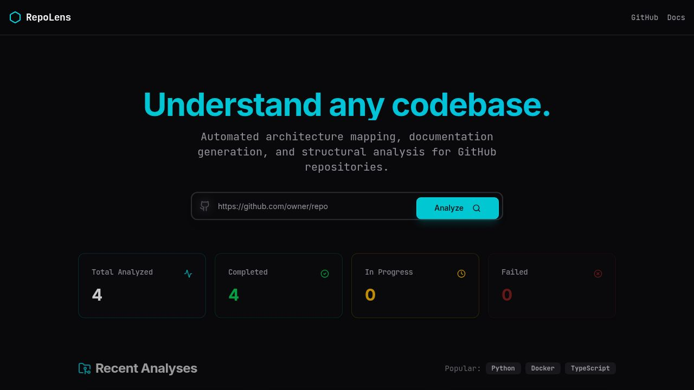
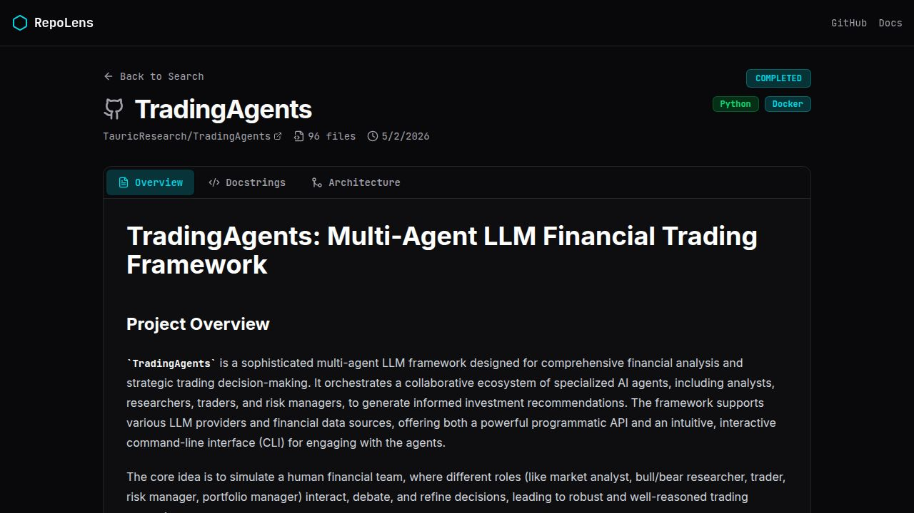

<div align="center">

# RepoLens

### Understand any codebase — instantly.

**RepoLens** is an AI-powered documentation agent that takes any public GitHub repository URL and automatically generates a professional README, inline docstrings, and an interactive architecture diagram — all in under 30 seconds.



[](https://www.typescriptlang.org/)
[](https://react.dev/)
[](https://expressjs.com/)
[](https://orm.drizzle.team/)
[](https://deepmind.google/technologies/gemini/)

</div>

---

## What it does

Paste a GitHub repo URL. RepoLens clones it, reads the source files, detects the tech stack, and runs three parallel Gemini LLM tasks:

| Output | Description |
|---|---|
| **README** | Full professional README with project overview, features, installation steps, and usage examples — written as if by a senior engineer who read all the code |
| **Docstrings** | Inline documentation for every major function, class, and module across the codebase, in the correct format for the language (JSDoc, Python docstrings, Rustdoc, etc.) |
| **Architecture Diagram** | Interactive Mermaid flowchart showing how all components connect — frontend, backend, database, external services |

---

## Screenshots

### Dashboard



The repo page shows tech stack badges, file count, analysis date, and three tabs for the generated outputs. A live progress indicator tracks each pipeline stage: cloning → analyzing → generating → completed.

---

## Tech Stack

**Frontend**
- React 19 + Vite
- Tailwind CSS + shadcn/ui
- `react-markdown` + `remark-gfm` for README rendering
- `mermaid` for interactive architecture diagrams
- `wouter` for client-side routing
- TanStack Query for data fetching and status polling

**Backend**
- Node.js 24 + Express 5
- `simple-git` for repository cloning
- Google Gemini 2.5 Flash via Replit AI Integrations
- PostgreSQL + Drizzle ORM
- Zod validation on all API inputs/outputs
- Pino structured logging

**Monorepo**
- pnpm workspaces
- OpenAPI-first contract with Orval codegen
- TypeScript 5.9 strict mode throughout

---

## Project Structure

```
repolens/
├── artifacts/
│   ├── api-server/          # Express API + analysis pipeline
│   │   └── src/
│   │       ├── lib/
│   │       │   ├── analyzer.ts        # Git clone, file traversal, tech detection
│   │       │   ├── llm.ts             # Gemini prompts + Mermaid sanitizer
│   │       │   └── analysis-worker.ts # Background pipeline orchestrator
│   │       └── routes/
│   │           └── repos.ts           # All /api/repos endpoints
│   └── repolens/            # React + Vite frontend
│       └── src/
│           ├── pages/
│           │   ├── home.tsx           # Landing page + recent analyses
│           │   └── repo.tsx           # Analysis dashboard
│           └── components/
│               └── mermaid-diagram.tsx # Diagram renderer + sanitizer
├── lib/
│   ├── api-spec/            # OpenAPI contract + Orval codegen
│   └── db/                  # Drizzle schema + migrations
└── pnpm-workspace.yaml
```

---

## How the Analysis Pipeline Works

```
User submits GitHub URL
        │
        ▼
  POST /api/repos/analyze
        │
        ▼
  Background worker starts
        │
        ├─── 1. Clone repo (simple-git)
        │
        ├─── 2. Traverse files, detect tech stack
        │         (languages, frameworks, config files)
        │
        ├─── 3. Generate README (Gemini, up to 8k tokens)
        │
        ├─── 4. Generate Docstrings (Gemini, up to 8k tokens)
        │
        └─── 5. Generate Architecture Diagram
                  │
                  ├── Ask Gemini for structured JSON
                  │   {subgraphs, nodes, edges}
                  │
                  ├── Build Mermaid programmatically from JSON
                  │   (syntax errors structurally impossible)
                  │
                  └── Fallback: sanitize raw Mermaid if JSON fails
                      (strip style directives, clean labels,
                       fix quoted edge labels, balance subgraphs)
```

The frontend polls `/api/repos/:id/status` every 2 seconds and transitions through status badges in real time until `completed` or `failed`.

---

## Architecture Diagram Quality

Getting Mermaid to render cleanly from LLM output is harder than it sounds. RepoLens uses a **three-layer sanitization strategy**:

1. **JSON-first generation** — the LLM is asked to return a structured JSON object describing nodes and edges. Mermaid is built programmatically from that JSON, so syntax errors are impossible on the happy path.

2. **Server-side sanitizer** — if the LLM ignores the JSON instruction and returns raw Mermaid, a sanitizer runs before the diagram is stored to the database:
   - Strips `style`, `classDef`, `class`, `click`, `linkStyle` directives
   - Cleans all node labels (removes `(){}[]<>&:|"'\^~\``)
   - Converts `-- ""quoted labels"" -->` to `-- clean label -->`
   - Strips parenthesised groups and stray colons from edge labels
   - Auto-balances unclosed `subgraph` / `end` blocks

3. **Frontend sanitizer** — the same rules run in the browser as a last resort before Mermaid renders.

---

## API Reference

| Method | Path | Description |
|---|---|---|
| `POST` | `/api/repos/analyze` | Submit a GitHub repo URL for analysis |
| `GET` | `/api/repos` | List all analyzed repositories |
| `GET` | `/api/repos/:id` | Get full repo details + generated content |
| `GET` | `/api/repos/:id/status` | Poll analysis status |
| `GET` | `/api/repos/stats/summary` | Aggregate counts by status |

**POST /api/repos/analyze**
```json
{
  "repoUrl": "https://github.com/owner/repo"
}
```

**Response (202 Accepted)**
```json
{
  "id": 7,
  "repoUrl": "https://github.com/owner/repo",
  "repoName": "repo",
  "owner": "owner",
  "status": "cloning"
}
```

**Status values:** `pending` → `cloning` → `analyzing` → `generating` → `completed` / `failed`

---

## Database Schema

```sql
CREATE TABLE repos (
  id                    SERIAL PRIMARY KEY,
  repo_url              TEXT NOT NULL UNIQUE,
  repo_name             TEXT NOT NULL,
  owner                 TEXT NOT NULL,
  status                TEXT NOT NULL DEFAULT 'pending',
  tech_stack            JSONB,
  file_count            INTEGER,
  generated_readme      TEXT,
  generated_docstrings  TEXT,
  generated_architecture TEXT,
  error_message         TEXT,
  created_at            TIMESTAMP DEFAULT NOW(),
  updated_at            TIMESTAMP DEFAULT NOW()
);
```

---

## Local Development

**Prerequisites:** Node.js 20+, pnpm 9+, PostgreSQL

```bash
# Install dependencies
pnpm install

# Push database schema
pnpm --filter @workspace/db run push

# Start API server (port from $PORT env, defaults in workflow config)
pnpm --filter @workspace/api-server run dev

# Start frontend dev server
pnpm --filter @workspace/repolens run dev
```

**Regenerate API hooks from OpenAPI spec**
```bash
pnpm --filter @workspace/api-spec run codegen
```

**Full typecheck**
```bash
pnpm run typecheck
```

---

## Environment Variables

| Variable | Description |
|---|---|
| `DATABASE_URL` | PostgreSQL connection string |
| `AI_INTEGRATIONS_GEMINI_BASE_URL` | Gemini API base URL (auto-set by Replit) |
| `AI_INTEGRATIONS_GEMINI_API_KEY` | Gemini API key (auto-set by Replit) |
| `SESSION_SECRET` | Session signing secret |

---

## License

MIT
